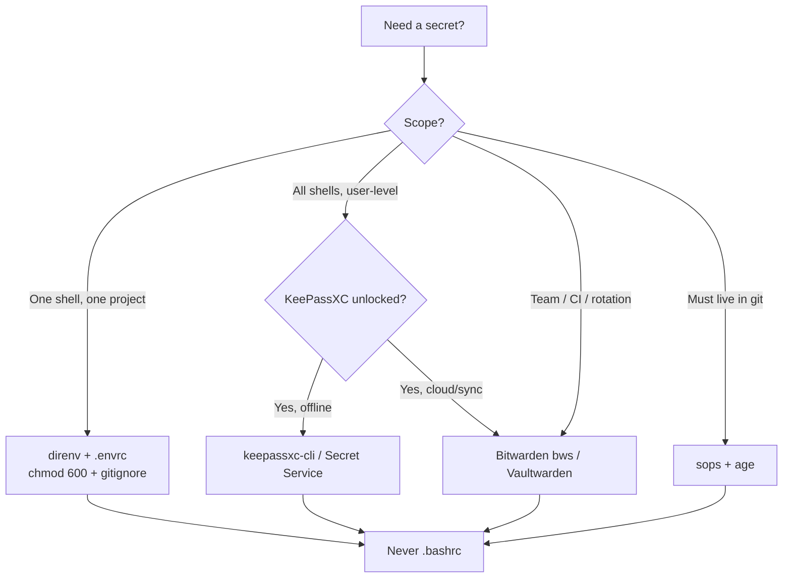

# Linux User Secrets — From .bashrc to KeePassXC & Vaultwarden Secure Flows

> Why `.bashrc` is the worst vault and how to replace it with isolated, encrypted, and programmatic flows on a single-user Linux box — using what you already have: [[KeePassXC]] + [[Bitwarden]]/Vaultwarden (`bws`).

## TL;DR Decision Tree



> [!danger] The `.bashrc` Anti-Pattern
> `export SECRET=...` in `~/.bashrc` leaks to **every child process**, `ps e` on some systems, shell history, dotfile backups, and dotfile repos. It cannot be unloaded per-project and is sourced even for non-interactive shells. Replace on day one.

---

## 1. The 9 Methods — Ranked by Security / Ergonomics

| # | Method | At Rest | In Memory | Git-Safe | Best For | Verdict |
|---|---|---|---|---|---|---|
| 1 | `.bashrc` `export` | plaintext, `644` | forever, all procs | no | nothing | **Never** |
| 2 | Isolated `~/.config/secrets.env` `chmod 600` | plaintext, `600` | per-shell only | no | 5-min fix | Okay |
| 3 | `direnv` + `.envrc` | plaintext, `600`, per-dir | auto unload on `cd` | `gitignore` + `direnv deny` | per-project dev | **Recommended** |
| 4 | `systemd environment.d` | plaintext, `600` | systemd user unit | no | user daemons | Niche |
| 5 | `libsecret` / `secret-tool` (GNOME Keyring) | encrypted by login | D-Bus, unlocked | yes | desktop apps | Good |
| 6 | **KeePassXC** — `keepassxc-cli` | `AES-256` `.kdbx`, `600` | pipe only | yes (db) | offline single user | **Recommended** |
| 7 | **KeePassXC** — Secret Service + `keepassxc-proxy` | same | D-Bus / native messaging | yes | browsers, `libsecret` | Recommended |
| 8 | `sops` + `age` | `age` encrypted | `sops exec-env` | **yes** | secrets in repo | **Recommended** |
| 9 | **Vaultwarden / Bitwarden `bws`** | Vaultwarden server | `bws secret list` JSON, `600` cache | yes | team, sync, hermes | **Recommended** |

> [!tip] What you already have
> `Bitwarden Desktop` (`/opt/Bitwarden`, autostart) + `bwrap` `keepassxc-proxy` + `hermes-agent` `bws v2.0.0` auto-install to `~/.hermes/bin/bws` (`~/.hermes/.env` holds only `BWS_ACCESS_TOKEN`) + `bancada-amanuense` `INJECT_FROM_VAULTWARDEN` pattern. No `vaultwarden` container is running yet — `bws` supports self-host via `BWS_SERVER_URL`.

---

## 2. Quick Fix — Isolated `chmod 600` File (2 min)

```bash
mkdir -p ~/.config
touch ~/.config/secrets.env
chmod 600 ~/.config/secrets.env
cat >> ~/.config/secrets.env <<'EOF'
OPENAI_API_KEY=sk-...
GITHUB_TOKEN=ghp_...
EOF

# source only if present, don't export to every proc
grep -q "secrets.env" ~/.bashrc || cat >> ~/.bashrc <<'EOF'
[ -f ~/.config/secrets.env ] && set -a; source ~/.config/secrets.env; set +a
EOF
```

> [!warning] Still plaintext — never commit, never backup unencrypted.

---

## 3. Per-Project — `direnv` (The Daily Driver)

```bash
sudo apt install direnv
echo 'eval "$(direnv hook bash)"' >> ~/.bashrc
exec bash

# in each repo
echo 'source_env ~/.config/secrets.env' > .envrc   # or dotenv .env
# or per-project:
cat > .envrc <<'EOF'
dotenv .env
# or: export HF_TOKEN=$(pass show hf/token)  # keep .env out of repo
EOF
echo ".env" >> .gitignore
echo ".envrc" >> .gitignore  # if it holds secrets; otherwise commit it
direnv allow
```

`direnv` loads on `cd` in, unloads on `cd` out — no global pollution.

---

## 4. `systemd` User Level

```bash
mkdir -p ~/.config/environment.d
cat > ~/.config/environment.d/10-secrets.conf <<'EOF'
OPENAI_API_KEY=sk-...
EOF
chmod 600 ~/.config/environment.d/10-secrets.conf
systemctl --user daemon-reload  # new units see it
# credential variant (systemd >= 247): LoadCredential= in unit file
```

Only for systemd user services, not shells.

---

## 5. OS Keyring — `libsecret` / `secret-tool`

Requires KeePassXC **Secret Service Integration** enabled (`Tools → Settings → Secret Service → Enable`, expose DB).

```bash
secret-tool store --label='openai' service openai account default <<< "sk-..."
secret-tool lookup service openai account default
python3 -c "import secretstorage; print(list(secretstorage.dbus_init().get_all_collections()))"

# shell fetch (no file ever)
export OPENAI_API_KEY="$(secret-tool lookup service openai account default)"
```

Bindings: `libsecret` (C), `secretstorage` (Python), `git-credential-libsecret`.

---

## 6. KeePassXC — The 3 Endpoints You Already Run

You run `keepassxc-proxy` via `bwrap` for Chrome/Firefox (`com.8bit.bitwarden.json`-style native messaging at `~/.config/.../NativeMessagingHosts`).

### 6a. `keepassxc-cli` — Scripting King

```bash
# install (if needed)
sudo apt install keepassxc

# one-time: create/identify DB
keepassxc-cli db-create -p ~/vault.kdbx
# or open existing: ~/Documents/KeePassVaultWork/*.kdbx, `~/KeePassVaultWork` (old path missing — re-locate)

# add
keepassxc-cli add -p ~/vault.kdbx "prod/openai"

# fetch — NEVER echo to file, pipe directly
export OPENAI_API_KEY="$(keepassxc-cli show -s ~/vault.kdbx prod/openai --attributes password)"
keepassxc-cli show -s ~/vault.kdbx prod/openai --attributes notes  # custom fields

# batch env inject (memory-only)
set -a; source <(keepassxc-cli export ~/vault.kdbx --format csv | awk -F, '{print $1"="$2}'); set +a
```

> [!tip] KeePassXC CLI unlocks the DB per invocation — pass password via `stdin` or keyfile to avoid `ps` exposure: `keepassxc-cli show -s ~/vault.kdbx entry <<< "$KDBX_PASSWORD"`.

### 6b. Secret Service (D-Bus) — KeePassXC as `libsecret` Provider

Enable, then `secret-tool` and any `libsecret` app talks to KeePassXC automatically (no extra code).

### 6c. Browser `keepassxc-proxy` — Extension API

Chrome/Firefox `keepassxc-browser` uses `bwrap -- keepassxc-proxy` (your `ps` shows 4 `bwrap` proxies). Also usable headless: `keepassxc-proxy` speaks JSON over stdin/stdout — for custom apps.

| Endpoint | Auth | Unlock | Scripting | Language |
|---|---|---|---|---|
| `keepassxc-cli` | DB password/keyfile | per call | `bash`, `direnv` | any |
| Secret Service | login keyring | once per session | `secret-tool`, `secretstorage` | C/Python/Go |
| `keepassxc-proxy` | association flow | once | JSON native messaging | JS, custom |

---

## 7. `sops` + `age` — Secrets IN Git, Encrypted

```bash
# install
sudo apt install age sops  # or: go install
age-keygen -o ~/.config/sops/age/keys.txt  # public key: age1...
chmod 600 ~/.config/sops/age/keys.txt

cat > .sops.yaml <<'EOF'
creation_rules:
  - path_regex: secrets/.*\.yaml$
    age: age1yourpublickey...
EOF

cat > secrets/prod.yaml <<'EOF'
OPENAI_API_KEY: sk-...
EOF
sops --encrypt --in-place secrets/prod.yaml
git add secrets/prod.yaml .sops.yaml

# run without ever writing plaintext
sops exec-env secrets/prod.yaml 'python app.py'
sops exec-env secrets/prod.yaml 'bash -c "env | grep OPENAI"'
```

Git sees ciphertext, CI decrypts with private key from Vaultwarden/KeePassXC.

---

## 8. Vaultwarden / Bitwarden Secrets Manager (`bws`) — What You `Kinda Have`

### Current State

- `Bitwarden Desktop` + `bws v2.0.0` via `hermes-agent` (`agent/secret_sources/bitwarden.py`): auto-downloads `bws` to `~/.hermes/bin/bws`, verifies SHA-256, calls `bws secret list <project_id> --output json`, caches in-process + `~/.hermes/cache/bws_cache.json` (`0600`), `~5ms` on hit vs `~380ms` fetch.
- Bootstrap secret only: `BWS_ACCESS_TOKEN` in `~/.hermes/.env` (or `secrets.bitwarden.access_token_env`). Everything else lives in BSM.
- Self-host ready: `server_url` → `BWS_SERVER_URL` env to subprocess. Empty = `https://vault.bitwarden.com` (US); set `https://vault.bitwarden.eu` or `https://vaultwarden.yourdomain`.

### Self-Host Vaultwarden (Deploy When Ready)

```bash
# docker — 1 container, sqlite by default, ~30MB RAM
docker run -d --name vaultwarden \
  -v ./vw-data/:/data/ \
  -p 127.0.0.1:8080:80 \
  -e ADMIN_TOKEN="$(openssl rand -base64 48)" \
  vaultwarden/server:latest
# put behind Caddy/Traefik TLS, then in env:
# BWS_SERVER_URL=https://vaultwarden.example.com
```

### `bws` Programmatic Flow (Hermes Pattern — Copy It)

```bash
# bootstrap — one secret in ~/.config/bws.env (0600)
echo 'BWS_ACCESS_TOKEN=0.abc...xyz' > ~/.config/bws.env
chmod 600 ~/.config/bws.env

# fetch project secrets (JSON), never write plaintext
export BWS_SERVER_URL="https://vaultwarden.example.com"  # or leave empty for cloud
bws secret list 11111111-2222-3333-4444-aaaaaaaaaaaa --output json | jq -r '.[] | "\(.key)=\(.value)"'

# memory-only inject — hermes does exactly this
set -a; source <(bws secret list <project_id> --output json | jq -r '.[] | "\(.key)=\(.value)"' | sed 's/^/export /'); set +a

# direnv + bws (per-project, no .env file)
cat > .envrc <<'EOF'
export BWS_ACCESS_TOKEN="$(secret-tool lookup service bws account default)"
source <(bws secret list <project_id> --output json | jq -r '.[] | "export \(.key)=\(.value | @sh)"')
EOF
direnv allow

# sops + bws — private age key lives in BSM
bws secret get age-private-key --output json | jq -r .value > ~/.config/sops/age/keys.txt
chmod 600 ~/.config/sops/age/keys.txt
```

> [!success] Migration from `.env`
> `bancada-amanuense/backend/deploy/llm-prod-2.env.example` already marks `INJECT_FROM_VAULTWARDEN` — replace `POSTGRES_PASSWORD`, `REDIS_PASSWORD`, `MINIO_ROOT_PASSWORD` with `bws` fetch at deploy; `fortiman` wants this by week — use the hermes `bitwarden.py` as reference (`cache_ttl_seconds`, `server_url`, `bws_cache.json`).

---

## 9. Ultra-Secure Programmatic Patterns (Never Touch Disk)

| Pattern | Snippet | Why Secure |
|---|---|---|
| **Process substitution** | `source <(keepassxc-cli show -s db.kdbx prod/env)` | tmpfs pipe, no file, no history |
| **`bws` + `direnv`** | `.envrc: source <(bws secret list <id> \| jq ...)` | auto unload, no `.env` |
| **`sops exec-env`** | `sops exec-env secrets.yaml 'your-app'` | decrypt → env → exec, plaintext never hits disk |
| **`systemd-run --setenv`** | `systemd-run --user --setenv=TOKEN="$(secret-tool lookup ...)" -- your-app` | cgroup-scoped env |
| **`op`/`bw` run** | `op run --env-file=.env -- your-app` / `bw get password id \| app` | manager injects, app never reads file |
| **`secret-tool` pipe** | `myapp --token "$(secret-tool lookup service api)"` | arg is `/proc/self/environ` only; prefer env var |

> [!warning] Avoid These Leaks
> `echo $SECRET` in history → prefix with ` ` (space) or `HISTCONTROL=ignorespace`. `ps e` → export, don't pass as `cmd --token $SECRET`. `env` dump → scope secrets to `direnv`/`systemd-run`. Always `chmod 600`, never `644`.

---

## 10. Comparison — Choose in 30 Seconds

| Need | Use |
|---|---|
| Single laptop, offline | KeePassXC `keepassxc-cli` + `direnv` |
| Laptop + browser fill | KeePassXC Secret Service + `keepassxc-proxy` |
| `git` must hold secrets | `sops` + `age` (key in KeePassXC/BWS) |
| Team / sync / rotation / hermes | Vaultwarden + `bws` (`BWS_ACCESS_TOKEN` + `BWS_SERVER_URL`) |
| 5-min fix today | `~/.config/secrets.env` `600` + `direnv allow` |

---

## 11. Migration Checklist (From `.bashrc`)

- [ ] `grep -n export ~/.bashrc` → move to `~/.config/secrets.env` (`600`) or KeePassXC/BWS
- [ ] Remove from `~/.bashrc`, replace with `[ -f ~/.config/secrets.env ] && set -a; source ...`
- [ ] `echo ".env" >> .gitignore` + `secret-tool`/`bws` fetch in every repo's `.envrc`
- [ ] `git-secrets` / `gitleaks` pre-commit: `gitleaks protect --staged`
- [ ] Rotate any secret that lived in `~/.bashrc` plaintext (now in shell history/backups)
- [ ] Hermes: move provider keys from `~/.hermes/.env` to BSM project, keep only `BWS_ACCESS_TOKEN`
- [ ] Bancada: implement `vaultwarden` deploy + `INJECT_FROM_VAULTWARDEN` at `backend/deploy/`

## Related

- [[OS]] — machine → vault → agents → sync
- [[Projects]] — `bancada-amanuense`, `fortiman`, `hermes-agent` — code stays outside vault
- [[Claude Code Proxy Pattern — Master Reference]] — proxy env keys should come from BWS/KeePassXC, never hardcoded
- [[Dashboard]] — pin + Homepage
- `~/.hermes/agent/secret_sources/bitwarden.py` — reference implementation
- `~/projetos/hub/bancada-amanuense/backend/deploy/llm-prod-2.env.example` — `INJECT_FROM_VAULTWARDEN` pattern

> [!question] Next Step
> Do you want a runnable `migrate-bashrc-to-bws.sh` that greps `~/.bashrc`, creates BSM entries via `bws secret create`, and rewrites `.bashrc`/`.envrc` in place?
