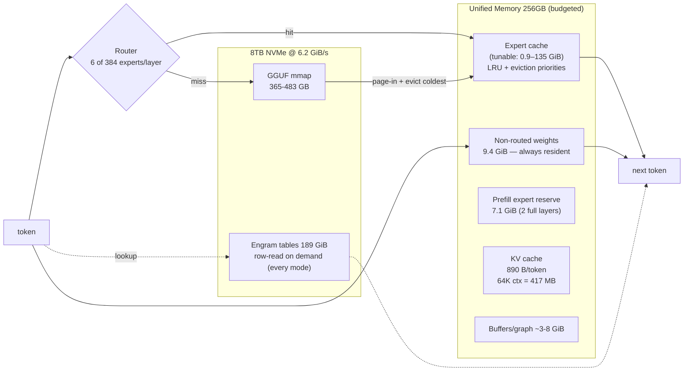

# Mac Studio MoE Disk Streaming — DeepSeek V4.1 Flash Experiments

Campaign: 2026-09-26 weekend, csis-mac-studio (borrowed CSIS machine, M3 Ultra 256GB/8TB). Hypothesis (Fabio, validated): *a 552B MoE can run in a small RAM budget by keeping only hot experts resident and streaming the rest from SSD.*

## TL;DR

- **DeepSeek V4.1-Flash Q2 (552B) runs at 8 t/s in 21 GiB of RAM**, 15 t/s at 113 GiB, 20 t/s resident (160 GiB).
- Knee of the t/s-vs-budget curve: **~64 GiB** (14.8 t/s). Beyond it: +0.25 t/s per extra 36 GiB.
- Expert popularity is a power law: **6.6% of experts (958/14592) recover 10.3 of the 15.1 t/s ceiling.**
- Cold-start vs preloaded cache at 32 GiB: **12.35 vs 12.42 t/s — popularity preload is negligible**; demand-fill converges in seconds.
- KV cache: 890 B/token (CSA2 + FP4-E2M1) → 64K ctx = 417 MB. Context is effectively free.

## Engine & model

| | |
|---|---|
| Engine | **DwarfStar** (antirez/ds4, C, Metal-first, commit 0aaea5a) |
| Why | llama.cpp PR #28696 (V4.1) still open; CED/CSA2/Engram need custom graph |
| Model | deepseek-ai/DeepSeek-V4.1-Flash — 552B backbone, 8B active @prefill / 16B @decode, 1 shared + 384 routed experts/layer (6 active/token), CED 20+20 layers, 1M ctx |
| Quant | antirez ds41f-q2 (365.7GB): IQ2_XXS gate/up + Q2_K down experts only; Q8 attention/shared/output; native FP8 Engram (189 GiB, always row-streamed from disk, never resident) |

## Architecture schematic

**Memory anatomy** (from DwarfStar startup report): of 152 GiB main weights, only **9.4 GiB is non-routed** (must be resident). The other ~142 GiB = 14,944 experts × 9.49 MiB — all optional cache.

## Results

### X1 — resident Q2 (ceiling), ds4-bench, 2K→64K ctx

| ctx | prefill t/s | gen t/s | KV bytes |
|---|---|---|---|
| 2048 | 315 | 20.5 | 24 MB |
| 32768 | 318 | 20.2 | 116 MB |
| 65536 | 269 | 19.3 | 417 MB |

Planned memory: 151.76 model + 7.84 buffers + 0.40 KV = 160.0 GiB.

### X2 — expert-cache budget sweep (fresh process per config, 500-word essay)

| Budget | Dynamic cache | Experts | Gen t/s | Total RAM |
|---|---|---|---|---|
| 8 GiB | 0.88 GiB | 95 (0.7%) | 8.0 | ~21 GiB |
| 16 GiB | 8.9 GiB | 958 (6.6%) | 10.3 | ~29 GiB |
| 32 GiB | 24.9 GiB | 2,684 (18%) | 12.4 | ~45 GiB |
| 64 GiB | 56.9 GiB | 6,136 (42%) | 14.8 | ~77 GiB |
| 100 GiB | 92.9 GiB | 10,019 (69%) | 15.0 | ~113 GiB |
| auto (142) | 135.3 GiB | 14,592 (97%) | 15.1 | ~155 GiB |

### X3 — cold vs preloaded (32 GiB)
12.35 vs 12.42 t/s. Preload irrelevant on this workload.

### X4 — Q4 (294 GiB main, model > RAM): see results/x4/ (filled 2026-09-26)

### Anomaly note
`ds4-bench --ssd-streaming` measured 0.56 t/s (snapshot-restore between probes thrashes the expert cache). Manual `ds4` runs are the trustworthy streaming protocol. Do not benchmark streaming with ds4-bench without checking this.

## Mechanics — why this works (the paper's craftsmanship)

- **Decode is bandwidth-bound**: cost/token ≈ active bytes moved. 16B active @ ~2.5 bpw avg ≈ 5 GB/token worst-case-cold; at 6.2 GiB/s SSD → ~1.2 s/token floor fully cold; with cache hits mostly RAM-resident → 8-20 t/s.
- **Prefill is compute-bound** (matrix-matrix): Macs are weak here (~30 TFLOPS FP16 class vs H100 ~1000). V4.1 counters with **8B active @ prefill** (CED projects decoder KV from encoder states — half the active params of decode). Streaming prefill reads in wide per-layer batches, overlapping compute with next layer's reads.
- **Engram (196B params)**: sparse conditional memory, token-based row lookup — architecturally born to be disk-resident.
- **Expert popularity is a power law** — that's the whole reason a 21 GiB footprint works.

## Extensions

- **MacBook M4 Pro 24GB** (Fabio's): ds41f-8GiB profile ≈ 21 GiB total — feasible with Thunderbolt SSD ≥ 2.5 GB/s sustained (40Gb/s TB4 ≈ 5 GB/s ceiling). Expert shuffle rate dominates t/s at tiny budgets — expect < 8 t/s but functional.
- **Ornith-1.5-35B-A3B on 24GB MacBook**: same trick via llama.cpp mmap (no DwarfStar needed; OS page cache = dumb LRU). A3B active → mostly cache-hits anyway.
- **Co-residency on Mac Studio 256GB**: GLM-5.3-Flash Q4 resident (~178 GiB DwarfStar glm53-q4, 40-60 t/s est.) + ds41f-8GiB (~21 GiB, 8 t/s) ≈ 199 GiB — both served concurrently by two ds4-server processes.

## Economics
$15k machine, 2yr 24/7 duty, ~3 concurrent big-model sessions → per-token cost rivals mid-tier API providers at zero marginal cost. Local inference also beats flaky cloud providers on reliability.

## References
- deepseek-ai/DeepSeek-V4.1-Flash — model card + DeepSeek_V41_Tech_Report.pdf (HF)
- antirez/deepseek-v4.1-flash-gguf — quant recipe (HF README)
- antirez/ds4 (DwarfStar) — README, docs/SSD_STREAMING.md, docs/MODELS.md, docs/PERFORMANCE.md (M5 Max 128GB baselines)
- llama.cpp PR #28696 — V4.1 support status (open)
- REAP (arXiv 2510.13999) — expert *pruning*, the different lever (see note: pruning ≠ offloading)
- MoE offloading literature: Eliseev & Mazur 2023 (Fast Inference of MoE with Offloading), EdgeMoE, MoE-Infinity, Fiddler, Pre-gated MoE

## Artifacts
- Mac: `~/ds4/results/` (x1-resident.csv, x2v2/, x4/), `~/ds41f-exp.sh`, `~/ds41f-x2v2.sh`, `~/ds41f-x4.sh`
- Models on Mac: `~/models/ds41f/` (Q2+vision), `~/ds4/gguf/` (Q4), `~/models/GLM-5.3-Flash-UD-IQ4_XS/` (llama.cpp-side, not DwarfStar-compatible)

## Deployment (2026-09-26 evening) — integrated into the upb router fleet

- **Standing lane**: GLM-5.3-Flash Q4_K resident — `ds4-server :8001` on studio, launchd `com.dwarfstar.glm53` (KeepAlive, cwd fix required, `mixed-prefill-quantum 1024`, 2 batched sessions). Verified via router: 11.7 t/s gen.
- **Deep lane (on-demand)**: ds41f-q2 streaming 8GiB cache — `ds4-server :8002`, launchd `com.dwarfstar.ds41f` (NOT auto-loaded; bootstrap when needed, ready in ~60s).
- **Router integration**: `upb/scripts/sync-macs.py` extended with glm53-ds4 + ds41f-ds4 lanes (tunneled via `macs-ds4-tunnel.service` on li, ports 18001/18002). Models: `glm53-ds4/glm-5.3-flash`, `ds41f-ds4/deepseek-v4.1-flash` via :8706.
- **Findings (hard-won)**:
  - macOS app firewall blocks unsigned ds4-server inbound → tunnel until `sudo socketfilterfw --add/--unblock /Users/csi/ds4/ds4-server` is run on the Mac.
  - DwarfStar single-instance lock → per-lane `DS4_LOCK_FILE` env.
  - launchd needs `WorkingDirectory` = ds4 repo (runtime .metal shader compile from cwd).
  - **Co-residency livelock**: GLM resident (178GiB mmap) + ds41f streaming concurrent = VM thrash (free pages → 67MB, ds41f prefill stalls at 0.4 t/s → deadlock). mmap'd weights are not pinnable. Run deep lane exclusively or on-demand.
  - plutil -replace on ProgramArguments indices mangles arrays — always rewrite plists wholesale.
